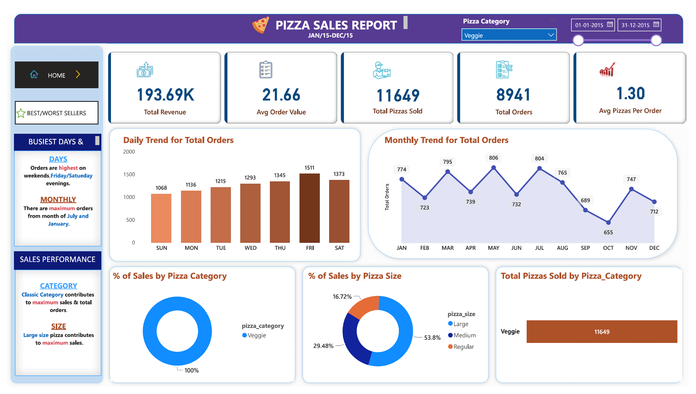
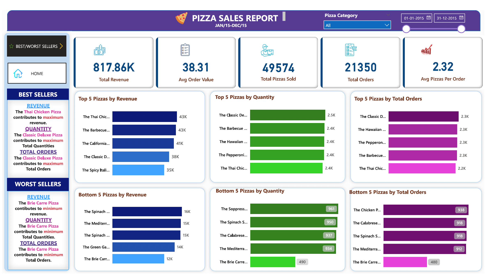

# Slice Insights: Pizza Sales Report with SQL and Power BI

This project utilizes SQL and Power BI to analyze annual pizza sales data. It involves executing SQL queries to extract key performance indicators, identifying daily and monthly sales trends, and calculating sales percentages by category and size. Power BI is employed for data cleaning, visualization, and dashboard creation, including a detailed analysis of top and bottom-selling items.

## Table of Contents

- [Features](#features)
- [Getting Started](#getting-started)
- [Data Analysis with SQL](#data-analysis-with-sql)
- [Creating Dashboards with Power BI](#creating-dashboards-with-power-bi)
- [Dashboard Overview](#dashboard-overview)
- [How to Use the Dashboard](#how-to-use-the-dashboard)
- [License](#license)

## Features

- **Daily and Monthly Trends**: Visualize pizza order totals and sales figures on a daily and monthly basis to gain insights into peak sales periods.

- **Pizza Category Analysis**: Examine sales by pizza category to understand customer preferences and identify popular categories.

- **Pizza Size Analysis**: Analyze sales distribution by pizza size, allowing you to adjust your menu based on customer preferences.

- **Top-Selling Pizzas**: Identify the top-selling pizzas by revenue, quantity, and total orders to optimize your menu and enhance profitability.

## Getting Started

1. **Data Analysis with SQL**:
   - The initial analysis was performed using SQL. SQL scripts and queries used for data extraction, transformation, and loading are available in the [Queries.pdf](Queries.pdf) file.

2. **Creating Dashboards with Power BI**:
   - The Power BI project file [slice_insights.pbix](slice_insights.pbix) contains the interactive dashboards. Open and customize this file using Power BI Desktop.

3. **Access the Dashboard**:
   - Open the `slice_insights.pbix` file with Power BI Desktop to explore the interactive dashboards.

## Data Analysis with SQL

The SQL analysis involved extracting and transforming data related to pizza sales, categories, sizes, and various key performance indicators. The analysis includes:
   - Tracking daily and monthly sales trends and revenue generation.
   - Identifying top-selling pizzas based on revenue, quantity, and total orders.
   - Determining least-selling pizzas based on similar metrics.
   - Calculating sales percentages by pizza category and customer orders.

## Creating Dashboards with Power BI

Power BI is utilized to create interactive dashboards for visualizing pizza sales data. The Power BI project file (`slice_insights.pbix`) features the following dashboards:

### Dashboard Overview

The **Pizza Sales Report** dashboards offer a user-friendly interface with the following views:

- **Trends**: Daily and monthly sales trends.
- **Pizza Category Analysis**: Breakdown of sales by pizza category.
- **Pizza Size Analysis**: Sales distribution by pizza size.
- **Top-Selling Pizzas**: Insights into top-selling pizzas based on various metrics.
- **Least-Selling Pizzas**: Analysis of least-selling pizzas based on similar metrics.

### Home Page Report Dashboard

### Best/Worst Sellers Report Dashboard

## How to Use the Dashboard

1. **Open Power BI Desktop**:
   - If you haven't already, install [Power BI Desktop](https://powerbi.microsoft.com/desktop/).

2. **Open the Project File**:
   - Launch Power BI Desktop and open the `slice_insights.pbix` file.

3. **Explore the Dashboards**:
   - Navigate between different views by selecting the tabs on the left side.

4. **Interact with Visuals**:
   - The visuals are interactive; hover, click, and filter the data to uncover deeper insights.

## License

This project is licensed under the MIT License.
